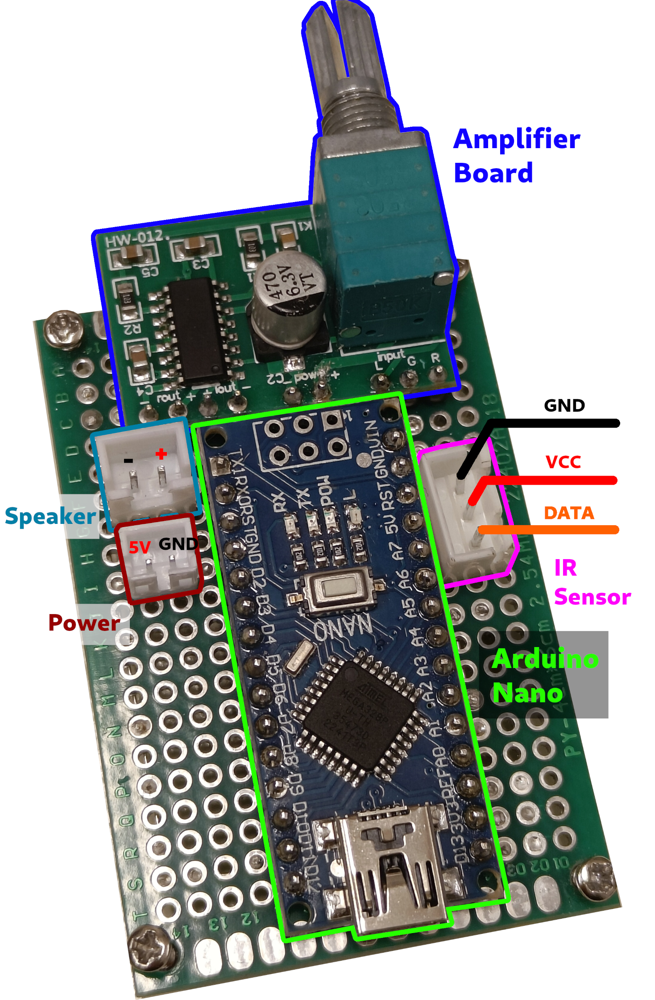
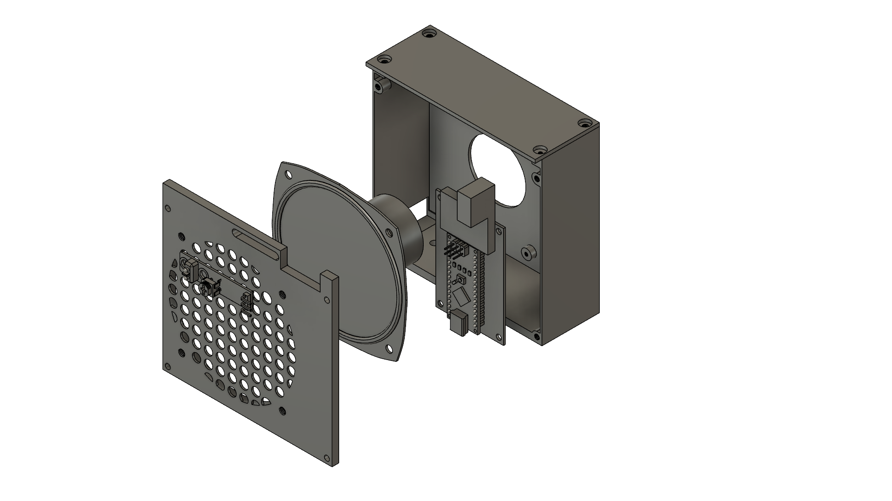
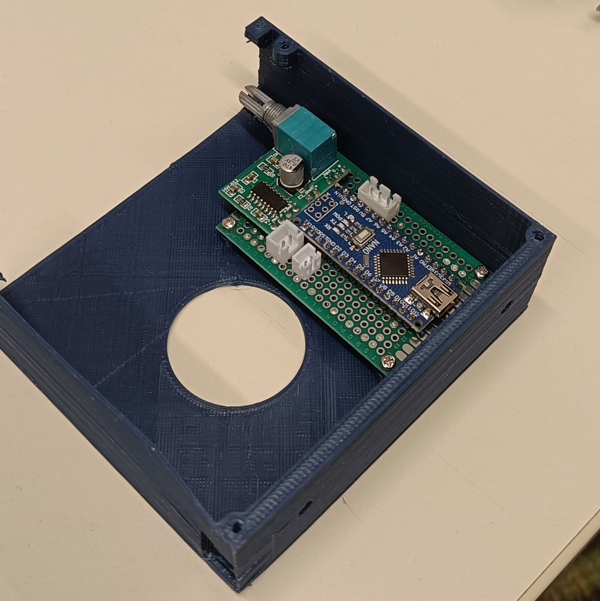
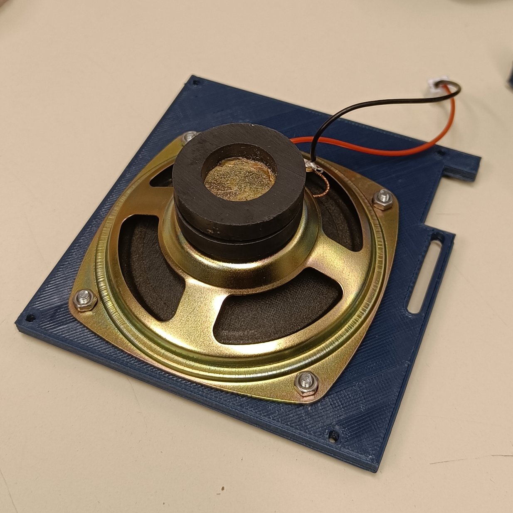
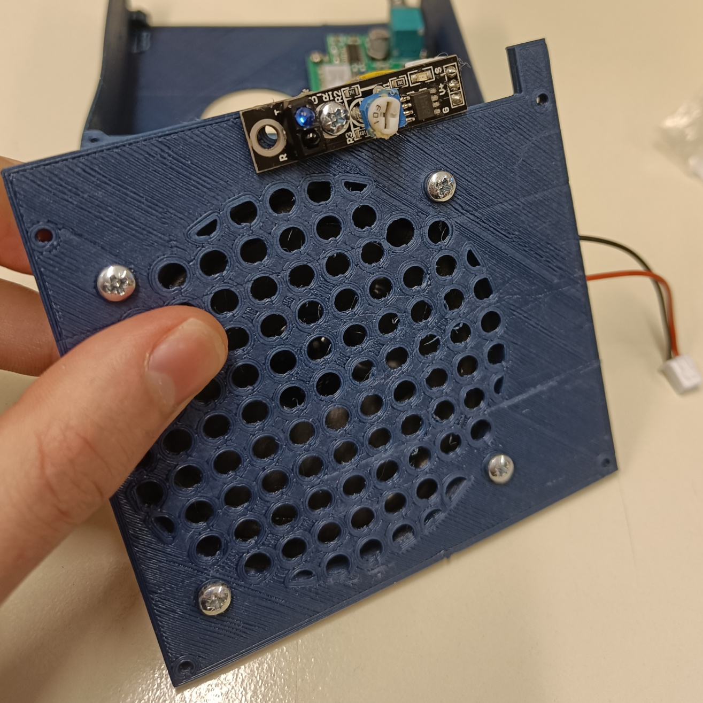
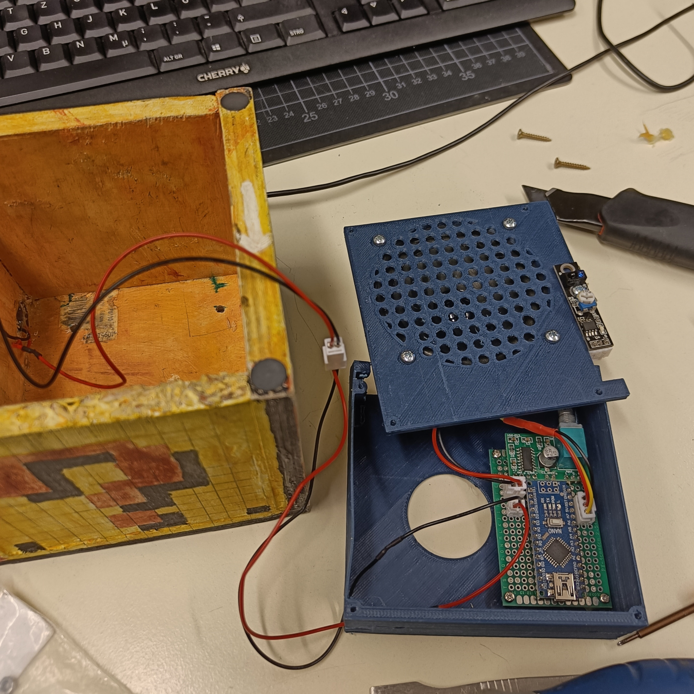
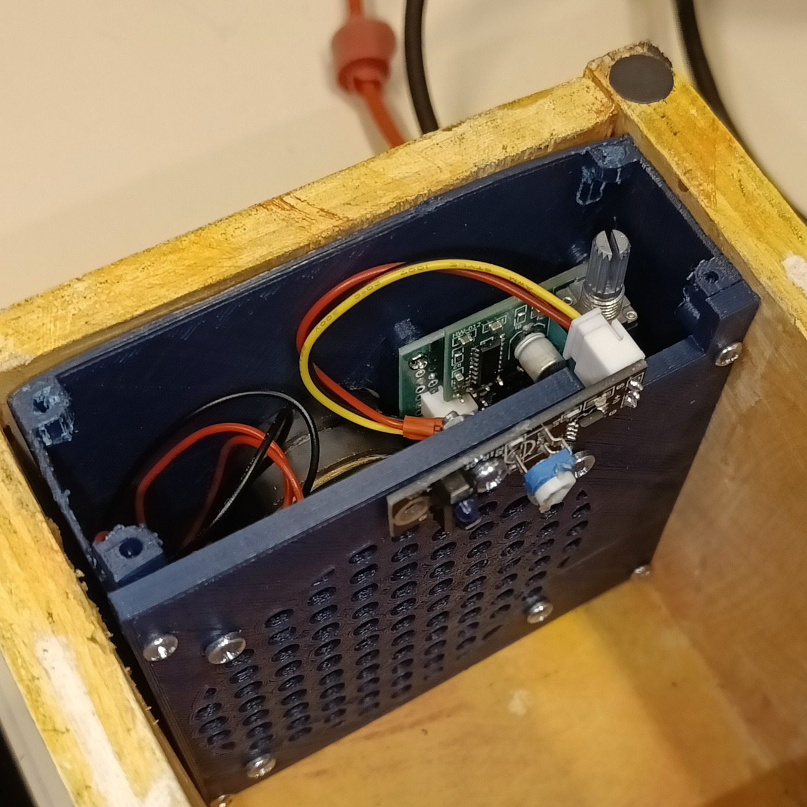
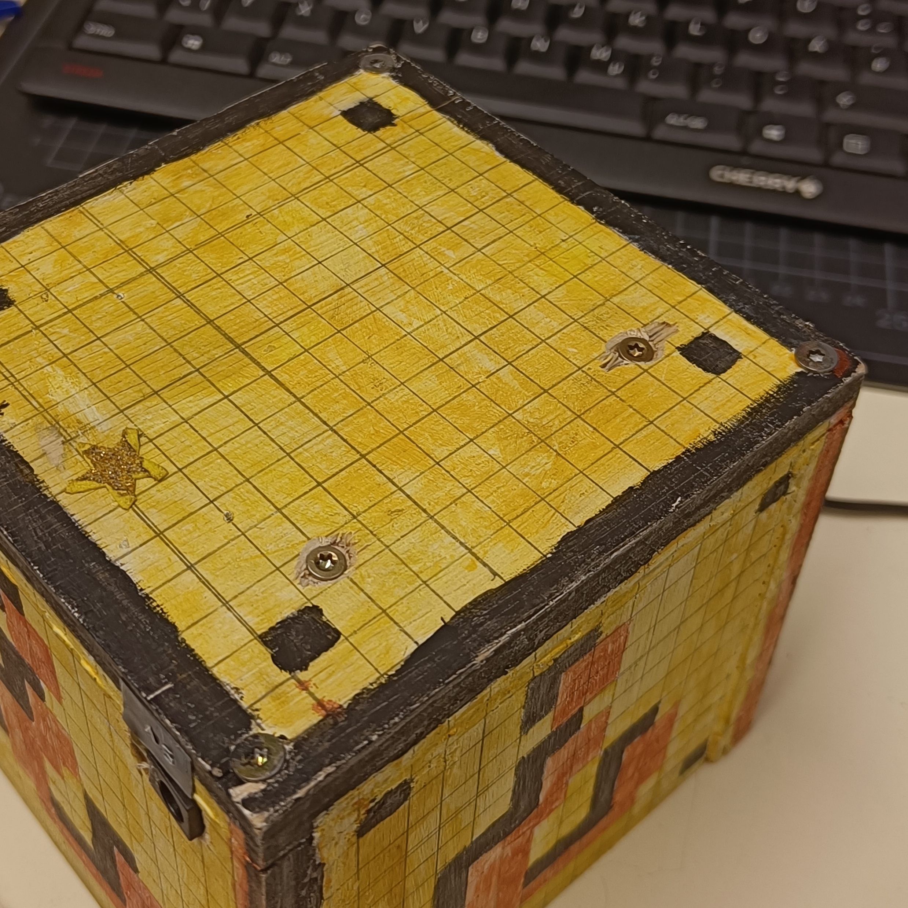
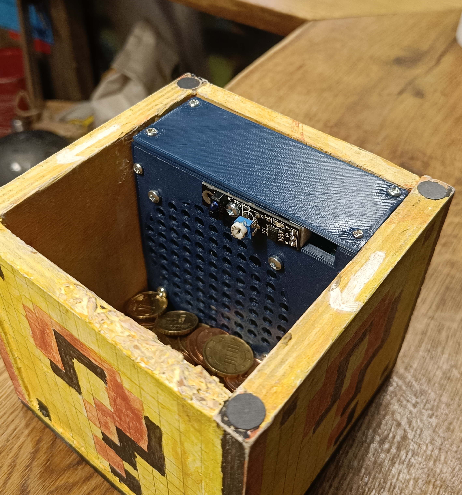

# Mario [ ? ] Block Cash Box <!-- omit in toc -->

https://github.com/user-attachments/assets/13c91ebd-0a8e-42fc-bb54-711a1d9b547c

## Table of Contents <!-- omit in toc -->

- [Building the Box](#building-the-box)
  - [Step 1. Cut the Wood](#step-1-cut-the-wood)
  - [Step 2. Glue the Pieces Together](#step-2-glue-the-pieces-together)
  - [Step 3. Secure the Bottom](#step-3-secure-the-bottom)
  - [Step 4. Lid slit](#step-4-lid-slit)
  - [Step 5. Hole for DC Jack](#step-5-hole-for-dc-jack)
  - [Step 6. Paint the Base Coat](#step-6-paint-the-base-coat)
  - [Step 7. Draw the Pixel Grid](#step-7-draw-the-pixel-grid)
  - [Step 8. Paint the Pixel Art](#step-8-paint-the-pixel-art)
  - [Step 9. Magnets for the Lid](#step-9-magnets-for-the-lid)
- [Electronics](#electronics)
  - [Components Required](#components-required)
  - [Wiring the Components](#wiring-the-components)
- [Software](#software)
  - [Overview](#overview)
  - [Configurable Parameters](#configurable-parameters)
  - [Sound Playback Implementation](#sound-playback-implementation)
- [Flashing the Arduino](#flashing-the-arduino)
- [Electronics Enclosure](#electronics-enclosure)
  - [Enclosure Components](#enclosure-components)
  - [Assembly Instructions](#assembly-instructions)
    - [1. Mounting the Perfboard](#1-mounting-the-perfboard)
    - [2. Attaching Speaker and Sensor](#2-attaching-speaker-and-sensor)
    - [3. Connecting Components](#3-connecting-components)
    - [4. Securing the Enclosure](#4-securing-the-enclosure)
    - [5. Sensor Calibration](#5-sensor-calibration)
    - [6. Screwing on the Lid](#6-screwing-on-the-lid)

## Building the Box

### Step 1. Cut the Wood

For the box, we cut 2 slightly larger pieces (dimensions: X x Y x Z) and 4 slightly smaller pieces (dimensions: X x Y x Z). The larger pieces make up the top and bottom, while the smaller pieces form the sides.

  

### Step 2. Glue the Pieces Together

Once the pieces are cut, glue them together to form the box. Make sure the edges are flush and the corners are square.

  

### Step 3. Secure the Bottom

Attach the bottom of the box using screws or nails for extra stability. Glue alone can work but might not be as durable.

  

### Step 4. Lid slit

Cut a slit in the lid to allow coins to be inserted into the box. Make sure the slit is wide enough to accommodate different coin sizes.
We used a size of X x Y.

TODO: Add Image

### Step 5. Hole for DC Jack

Drill a hole into the bottom of any side of the box to make room for a DC jack. We didn't have a panel mount DC jack, so we used a PCB one and simply glued it into the hole. We also soldered a JST connector to the jack so that it can be easily connected to the electronics, while still allowing the other electronics to be removed from the box for maintenance.

### Step 6. Paint the Base Coat

Apply a white base layer of paint to the box. This will make the final colors more vibrant. Acrylic paint is recommended.

  

### Step 7. Draw the Pixel Grid

Sketch a 16x16 pixel grid on the box. This will serve as a guide for your Super Mario-inspired design.

  

### Step 8. Paint the Pixel Art

Fill in the grid with bright colors to create the iconic Mario Question Block design.

  

### Step 9. Magnets for the Lid

Drill a hole into each corner of the box and lid. Insert and glue magnets into the holes. This allows the lid to remain in place, while still being easy to open.

  

## Electronics

### Components Required

For the electronics setup, you'll need the following components:

- Arduino Nano
- PAM8403 Audio Amplifier Board
- KY-033 Line Tracking Sensor
- Speaker
- Perfboard

### Wiring the Components

Connect the components as illustrated in the circuit diagram below:

> TODO: Add Circuit Diagram

For our project, we soldered the components onto a perfboard:

> Tip: We utilized JST connectors for connecting the speaker, sensor, and power supply to the perfboard. This allows for better maintainability.

## Software

### Overview

The project's software can be found in the [`src/`](src/) directory. It performs the following actions:

1. Initialization:
   - Initializes GPIO's and serial communication.
   - Displays a playful ASCII art message in the serial monitor.

2. Sensor Monitoring:
   - Continuously monitors input from the KY-033 line tracking sensor.
   - Detects objects (e.g., coins) passing over the sensor by detecting a transition from LOW to HIGH on the sensor pin.

3. Sound Playback:
   Once a coin is detected:
   - Standard: Plays the classic Mario coin sound effect each time a coin is detected.
   - Special: On every *n-th* coin (configurable), it plays either a One-Up or Power-Up sound effect instead of the standard coin sound. Currently, the Power-Up sound is played on every 4th coin and the One-Up sound on every 10th coin.

### Configurable Parameters

At the top of the main file, you can adjust the following parameters:

- `POWER_UP`: Determines the number of coins required to play the Power-Up sound effect.
- `ONE_UP`: Determines the number of coins required to play the One-Up sound effect.
- `SENSOR_PIN`: Specifies the pin connected to the KY-033 sensor.
- `WAIT_AFTER_COIN`: Sets the waiting time between consecutive sound playbacks. This prevents spam if the coin is detected for a longer duration.

### Sound Playback Implementation

We utilize [Damellis's PCM Library](https://github.com/damellis/PCM) to handle audio playback. To play a sound, we can use the startPlayback() function, which takes an array of raw 8-bit audio values. The Mario audio samples are stored in the `sounds.h` file as byte arrays, however, due to copyright restrictions, `sounds.h` is not included in this repository. Makerspace Members can access the file on our file server. For others, refer to this [Tutorial](https://highlowtech.org/?p=1963) for instructions.

## Flashing the Arduino

To upload the software to your Arduino Nano, follow these steps:

1. Install PlatformIO:
   - Download and install [PlatformIO](https://platformio.org/) as an extension for your preferred IDE (e.g., VS Code).

2. Open the Project:
   - Launch PlatformIO and open this project by navigating to `File > Open Folder` and selecting the project's root directory.

3. Connect Your Arduino:
   - Use a USB cable to connect your Arduino Nano to your computer.

4. Upload the Firmware:
   - In PlatformIO, click the Upload button (usually represented by an arrow icon) to compile and flash the software to your Arduino.

## Electronics Enclosure

To securely house the electronics and ensure proper protection, we designed and 3D printed a custom enclosure tailored specifically to our components (i.e. our Speaker, Perfboard etc.). Provided that you likely have different components, you will need to come up with your own enclosure design. **This section mostly serves as a reference for members of our makerspace to repair or modify our coin box.**

### Enclosure Components

The enclosure consists of three main parts. Click on the links below to download the corresponding `.3mf` files:

- [Back Part](enclosure/Back.3mf): Holds the perfboard containing the Arduino Nano and the Audio Amplifier.
- [Front Part](enclosure/Front.3mf): Houses the speaker and the sensor.
- [Lid](enclosure/Lid.3mf): Covers the enclosure once the front and back parts are assembled.

### Assembly Instructions

#### 1. Mounting the Perfboard

Secure the perfboard onto the Back Part of the enclosure using M2 screws.

   

#### 2. Attaching Speaker and Sensor

Attach the speaker and KY-033 sensor to the Front Part of the enclosure using M3 screws and a nut.

> Note: Do not fully tighten the nut for the sensor yet, as you may need to adjust its position later.
   
   
   

#### 3. Connecting Components

Connect the sensor, speaker, and DC barrel jack to the perfboard.

#### 4. Securing the Enclosure

Screw the front and back parts together using M3 screws. Then insert the assembled electronics into the wooden box. This may require some force. Use two wooden screws from the bottom of the wooden box to secure the enclosure in place through the designated holes.

#### 5. Sensor Calibration

- Before attaching the lid, power up the electronics and calibrate the sensor sensitivity to detect coins.
- Place the box lid on top of the enclosure.
- Test the sensor by inserting small coins. If the sensor misses any coins, adjust its position by loosening the nut, repositioning the sensor, and then tightening the nut once satisfied.

#### 6. Screwing on the Lid

Once the sensor is properly positioned, secure the 3D printed lid onto the enclosure using three M3 screws and one M2 screw.

